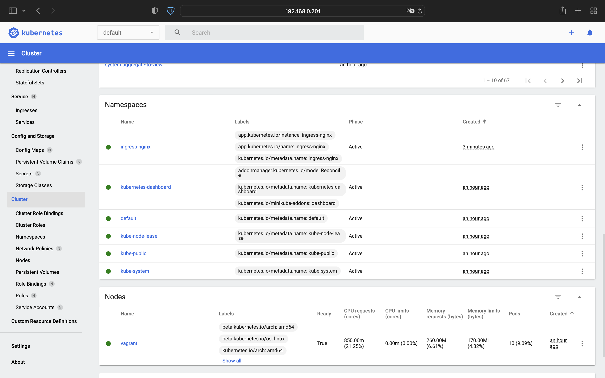

# 10.Kubernetes homework

## Minicube Commands
```bash

```

## Minicube Screenshot


##  K8s cluster Deployment (inside IT-ACADEMY environment)
```bash
PLAY RECAP ******************************************************************************************************************************************
localhost                  : ok=4    changed=0    unreachable=0    failed=0    skipped=0    rescued=0    ignored=0
node1                      : ok=768  changed=149  unreachable=0    failed=0    skipped=1315 rescued=0    ignored=6
node2                      : ok=507  changed=94   unreachable=0    failed=0    skipped=772  rescued=0    ignored=2

Нядзеля 22 мая 2022  17:09:52 +0300 (0:00:00.083)       0:20:47.584 ***********
===============================================================================
kubernetes/preinstall : Install packages requirements --------------------------------------------------------------------------------------- 69.34s
download : download_file | Validate mirrors ------------------------------------------------------------------------------------------------- 62.72s
download : download_container | Download image if required ---------------------------------------------------------------------------------- 32.13s
kubernetes/control-plane : kubeadm | Initialize first master -------------------------------------------------------------------------------- 29.08s
download : download_container | Download image if required ---------------------------------------------------------------------------------- 27.50s
download : download_container | Download image if required ---------------------------------------------------------------------------------- 26.76s
download : download_container | Download image if required ---------------------------------------------------------------------------------- 26.07s
kubernetes/kubeadm : Join to cluster -------------------------------------------------------------------------------------------------------- 25.09s
bootstrap-os : Assign inventory name to unconfigured hostnames (non-CoreOS, non-Flatcar, Suse and ClearLinux, non-Fedora) ------------------- 21.33s
container-engine/containerd : download_file | Download item --------------------------------------------------------------------------------- 20.44s
download : download_file | Download item ---------------------------------------------------------------------------------------------------- 18.92s
download : download_file | Download item ---------------------------------------------------------------------------------------------------- 18.36s
bootstrap-os : Update Apt cache ------------------------------------------------------------------------------------------------------------- 18.30s
download : download_container | Download image if required ---------------------------------------------------------------------------------- 17.68s
download : download_container | Download image if required ---------------------------------------------------------------------------------- 17.32s
container-engine/nerdctl : download_file | Download item ------------------------------------------------------------------------------------ 16.75s
container-engine/runc : download_file | Download item --------------------------------------------------------------------------------------- 16.28s
download : download_file | Download item ---------------------------------------------------------------------------------------------------- 15.93s
container-engine/crictl : download_file | Download item ------------------------------------------------------------------------------------- 15.63s
download : download_container | Download image if required ---------------------------------------------------------------------------------- 15.62s
ivan@UbMain:~/devops/it-academy.by/Ivan_Nemkovich/10.Kubernetes/kubespray$
```
