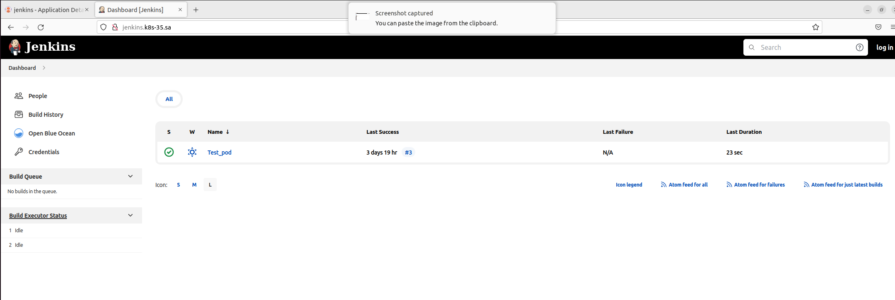
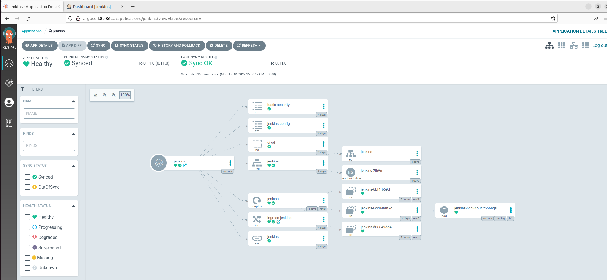

# 14.Kubernetes.ApplicationDeployment Homework

## Jenkins index.yml
``` yml
apiVersion: v1
entries:
  jenkins:
  - apiVersion: v2
    appVersion: 1.16.0
    created: "2022-06-06T15:34:08.25023829+03:00"
    description: A Helm chart for Kubernetes
    digest: bd949b12f30df9079a4caddf9612d1e4868eca29a7bc9a8b626e9e381f1f8af0
    name: jenkins
    type: application
    urls:
    - https://ivan-nemkovich.github.io/helm-repo/jenkins/jenkins-0.11.0.tgz
    version: 0.11.0
generated: "2022-06-06T15:34:08.238158032+03:00"
```

## Jenkins manifest
``` yml
project: default
source:
  repoURL: 'https://ivan-nemkovich.github.io/helm-repo/'
  targetRevision: 0.11.0
  chart: jenkins
destination:
  server: 'https://kubernetes.default.svc'
  namespace: ci-cd
syncPolicy:
  automated: {}
```

## Screenshots


